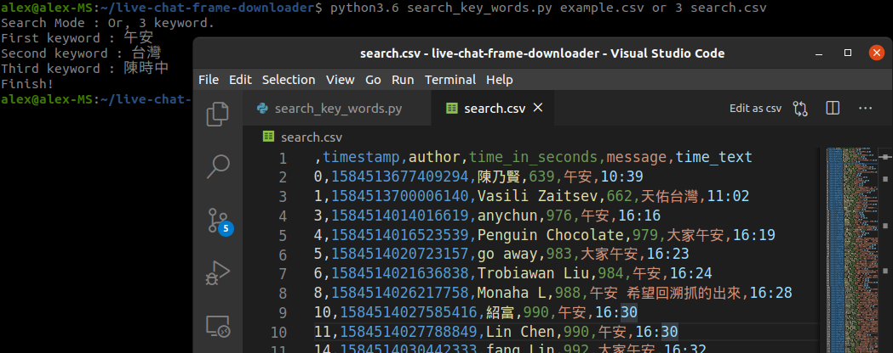

# Live Chat Frame Downloader
A simple tool used to retrieve YouTube/Twitch chat from past broadcasts/VODs.

### Requirements:
* This tool was created in a Python 3 environment.
* Run `pip3 install -r requirements.txt` to ensure you have the necessary dependencies.

### Command line:
#### Usage
```
usage: chat_replay_downloader.py [-h] [-start_time START_TIME]
                                 [-end_time END_TIME]
                                 [-message_type {messages,e,all}]
                                 [-output OUTPUT]
                                 url

Retrieve YouTube/Twitch chat from past broadcasts/VODs.

positional arguments:
  url                   YouTube/Twitch video URL

optional arguments:
  -h, --help            show this help message and exit
  -start_time START_TIME, -from START_TIME
                        start time in seconds or hh:mm:ss
                        (default: 0)
  -end_time END_TIME, -to END_TIME
                        end time in seconds or hh:mm:ss
                        (default: None = until the end)
  -message_type {messages,superchat,all}
                        types of messages to include [YouTube only]
                        (default: messages)
  -output OUTPUT, -o OUTPUT
                        name of output file
                        (default: None = print to standard output)
```

#### Exaemples
##### 1. Outpuefsdurl
```
python3 chat_replay_downloader.py <video_url> -output <file_name>
```


If the file name ends in `.json`, the array will be written to the file in JSON format. Similarly, if the file name ends in `.csv`, the data will be written in CSV format. <br> Otherwise, the chat messages will be outputted to the file in the following format:<br>
`[<time>] <author>: <message>`

##### 2. Output file of chat messages, starting at a certain time (in seconds or hh:mm:ss) until the end
```
python3 chat_replay_downloader.py <video_url> -start_time <time> -output <file_name>
```

##### 3. Output file of chat messages, starting from the beginning and ending at a certain time (in seconds or hh:mm:ss)
```
python3 chat_replay_downloader.py <video_url> -end_time <time> -output <file_name>
```

##### 4. Output file of chat messages, starting and ending at certain times (in seconds or hh:mm:ss)
```
python3 chat_replay_downloader.py <video_url> -start_time <time> -end_time <time> -output <file_name>
```

#### Example outputs
[JSON Example](examples/example.json):
```
python3 chat_replay_downloader.py https://www.youtube.com/watch?v=CiyvTnsSlfA -start_time 00:16:54 -end_time 00:16:59 -output example.json
```

[CSV Example](examples/example.csv):
```
python3 chat_replay_downloader.py https://www.youtube.com/watch?v=CiyvTnsSlfA -start_time 00:16:54 -end_time 00:16:59 -output example.csv
```

[Text Example](examples/example.txt):
```
python3 chat_replay_downloader.py https://www.youtube.com/watch?v=CiyvTnsSlfA -start_time 00:16:54 -end_time 00:16:59 -output example.txt
```

### Python module

#### Importing the module

```python
import chat_replay_downloader
```
or

```python
from chat_replay_downloader import get_chat_replay, get_youtube_messages, get_twitch_messages
```
The following examples will use the second form of importing.

#### Examples
##### 1. Return list of all chat messages, given a video url:
```python
youtube_messages = get_chat_replay('https://www.youtube.com/watch?v=xxxxxxxxxxx')
twitch_messages = get_chat_replay('https://www.twitch.tv/videos/xxxxxxxxx')
```

##### 2. Return list of all chat messages, given a video id
```python
youtube_messages = get_youtube_messages('xxxxxxxxxxx')
twitch_messages = get_twitch_messages('xxxxxxxxx')
```
<br/>

The following examples use parameters which all three methods (`get_chat_replay`, `get_youtube_messages`, `get_twitch_messages`) have. Both of the following parameters are optional:
* `start_time`: start time in seconds or hh:mm:ss (Default is 0, which is the start of the video)
* `end_time`: end time in seconds or hh:mm:ss (Default is None, which means it will continue until the video ends)

##### 3. Return list of chat messages, starting at a certain time (in seconds or hh:mm:ss)
```python
messages = get_chat_replay('video_url', start_time = 60) # Start at 60 seconds and continue until the end
```

##### 4. Return list of chat messages, ending at a certain time (in seconds or hh:mm:ss)
```python
messages = get_chat_replay('video_url', end_time = 60) # Start at 0 seconds (beginning) and end at 60 seconds
```

##### 5. Return list of chat messages, starting and ending at certain times (in seconds or hh:mm:ss)
```python
messages = get_chat_replay('video_url', start_time = 60, end_time = 120) # Start at 60 seconds and end at 120 seconds
```

## Search Keywords
### Example search keywords
```
python3 search_key_words.py [source file] [and/or] [how many keywords(1~10)] [output name]
```
Mode : And, 2 Keywords
  
```
python3 search_key_words.py example.csv and 2 search.csv
```
--  

Mode : Or, 3 Keywords
  
```
python3 search_key_words.py example.csv or 3 search.csv
```